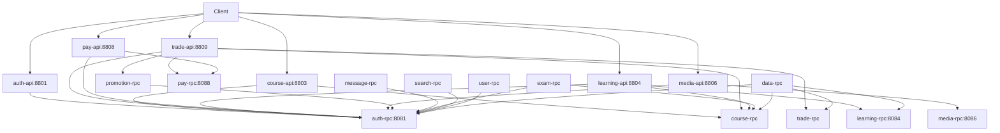

# 服务依赖拓扑与 RPC 调用链

> 版本：v1.0 | 更新：2026-08-05

## 服务依赖图



## 核心 RPC 调用链示例

### 下单支付链路
```
Client → trade-api → trade-rpc (创建订单)
                → promotion-rpc (校验优惠券)
                → pay-rpc (发起支付)
                → pay-rpc (回调确认)
                → message-rpc (发送下单通知)
                → learning-rpc (解锁课程)
```

### 学习进度同步链路
```
Client → learning-api → learning-rpc (记录进度)
                   → course-rpc (校验课程有效性)
                   → message-rpc (进度提醒/证书发放)
```

### 文件上传签名链路
```
Client → media-api → media-rpc (获取上传签名)
                  → auth-rpc (校验身份)
```

## 服务间契约原则

1. **接口稳定**：RPC 方法签名变更需向下兼容，新增字段用 `optional`
2. **超时控制**：跨服务调用统一 3s 超时，可在 `servicecontext` 配置覆盖
3. **熔断降级**：go-zero 内置熔断器，关键链路需配置 fallback
4. **幂等性**：写操作 RPC 需携带 `Idempotency-Key` 或业务主键保证幂等
5. **链路透传**：`trace-id` 通过 metadata 自动透传，日志关联