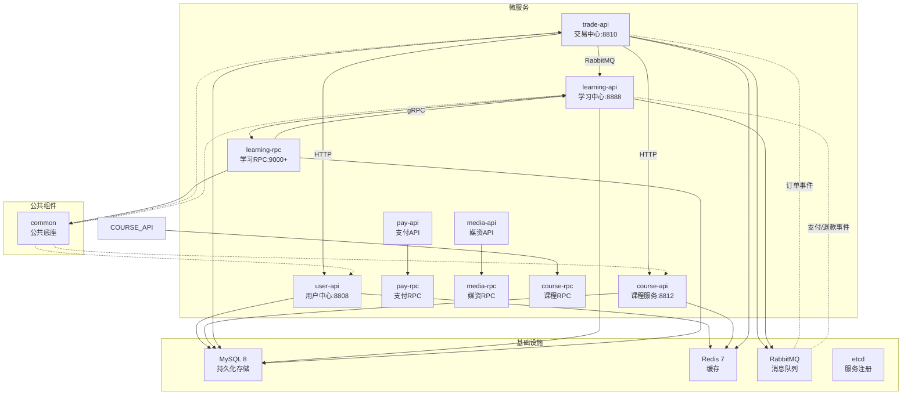

# 天机学堂 Go 微服务

基于 [go-zero](https://github.com/zeromicro/go-zero) 框架构建的在线教育微服务系统。

---

## 系统架构



## 服务概览

| 服务               | 端口    | 职责                    | 主要接口                                                                                       |
| ---------------- | ----- | --------------------- | ------------------------------------------------------------------------------------------ |
| **user**         | 8808  | 用户认证与管理中心              | `/accounts/` 登录/注册/刷新，`/users/` 用户CRUD，`/students/` 学员管理，`/teachers/*` `/staffs/*` 分页查询 |
| **course**       | 8812  | 课程与目录管理                | `/courses/` 课程CRUD/上下架/目录，`/categories/` 分类树/分页                                           |
| **trade**        | 8810  | 订单与交易中心                | `/carts/` 购物车，`/orders/` 订单，`/pay/` 支付，`/refund-apply/*` 退款                                |
| **learning**     | 8888  | 学习计划与进度                | `/lessons/` 课表/学习计划/进度                                                                     |
| **learning/rpc** | 9000+ | 内部学习RPC服务               | 供 trade 等内部服务调用                                                                             |
| **pay/api**      | -     | 支付API网关                 | 支付渠道管理、支付申请、回调处理                                                                         |
| **pay/rpc**      | -     | 支付核心服务                  | 支付通道、订单支付、退款处理                                                                         |
| **media/api**    | -     | 媒资API                    | 视频/文档上传、转码、分发                                                                          |
| **media/rpc**    | -     | 媒资核心服务                  | 媒资存储、处理、CDN分发                                                                            |
| **course/rpc**   | -     | 课程核心RPC服务               | 课程、分类、科目、教师、媒资的核心业务逻辑                                                                |

## 技术栈

- **框架**: go-zero (REST API + zRPC)
- **数据库**: MySQL 8 + sharding
- **缓存**: Redis
- **消息队列**: RabbitMQ
- **注册中心**: etcd
- **认证**: JWT (Access Secret 可配置)
- **ID生成**: 雪花算法

## 端口速查表

| 服务             | HTTP  | RPC                 | 服务名（etcd）     |
| ------------- | ----- | ------------------- | ------------ |
| user-api      | 8808  | -                   | user         |
| course-api    | 8812  | -                   | course       |
| trade-api     | 8810  | -                   | trade        |
| learning-api  | 8888  | 9000（learning.rpc）  | learning.rpc |
| pay-api       | -     | -                   | pay          |
| pay-rpc       | -     | -                   | pay.rpc      |
| media-api     | -     | -                   | media        |
| media-rpc     | -     | -                   | media.rpc    |
| course-rpc    | -     | -                   | course.rpc   |

## 本地启动

### 1. 启动基础设施

```powershell
# 启动 MySQL、Redis、RabbitMQ、etcd
docker compose up -d
```

### 2. 初始化数据库

```powershell
# 数据库脚本位于 sql/ 目录，容器初始化时自动执行
# 若需手动执行: mysql -h127.0.0.1 -uroot -p0000 < sql/tj_*.sql
```

### 3. 启动微服务

```powershell
# 用户中心
cd apps/user && go run . -f etc/user-api.yaml

# 课程服务
cd apps/course && go run . -f etc/course-api.yaml

# 学习中心
cd apps/learning && go run . -f etc/learning-api.yaml

# 学习RPC服务
cd apps/learning/rpc && go run . -f etc/learning.yaml

# 交易中心
cd apps/trade && go run . -f etc/trade-api.yaml

# 支付服务
cd apps/pay/api && go run . -f etc/pay-api.yaml
cd apps/pay/rpc && go run . -f etc/pay-rpc.yaml

# 媒资服务
cd apps/media/api && go run . -f etc/media-api.yaml
cd apps/media/rpc && go run . -f etc/media-rpc.yaml

# 课程RPC服务
cd apps/course/rpc && go run . -f etc/course-rpc.yaml
```

### 4. 验证服务

```powershell
# 用户中心
curl http://127.0.0.1:8808/accounts/login -X POST -H "Content-Type: application/json" -d '{"username":"admin","password":"123456","type":1}'

# 课程服务
curl http://127.0.0.1:8812/categories/tree

# 学习中心（需 JWT）
curl http://127.0.0.1:8888/lessons/now -H "Authorization: Bearer <token>"
```

## 演示账户

> 种子数据位于 `sql/tj_user.sql`，密码为 bcrypt 加密

| 账号                      | 类型  | 用途     |
| ----------------------- | --- | ------ |
| `admin` / `13500010002` | 员工  | 管理后台登录 |
| `jack` / `13500010003`  | 学员  | 学员前端登录 |
| `rose` / `13500010004`  | 学员  | 学员前端登录 |

```powershell
# 快速注册学员（无需密码，密码由服务自动生成）
curl http://127.0.0.1:8808/students/register -X POST -H "Content-Type: application/json" -d '{"cellPhone":"13800138000"}'

# 设置密码后登录
curl http://127.0.0.1:8808/accounts/login -X POST -H "Content-Type: application/json" -d '{"cellPhone":"13800138000","password":"123456","type":2}'
```

## 项目结构

```
tjxt/
├── apps/                  # 微服务业务领域目录
│   ├── user/              # 用户服务领域（独立 go.mod）
│   │   ├── api/           # 用户 HTTP API 服务
│   │   └── rpc/           # 用户 gRPC 服务
│   ├── course/            # 课程服务领域（独立 go.mod）
│   │   ├── api/
│   │   └── rpc/
│   ├── trade/             # 订单服务领域（独立 go.mod）
│   │   ├── api/
│   │   └── rpc/
│   ├── learning/          # 学习服务领域（独立 go.mod）
│   │   ├── api/
│   │   └── rpc/
│   ├── pay/               # 支付服务领域（独立 go.mod）
│   │   ├── api/
│   │   └── rpc/
│   └── media/             # 媒资服务领域（独立 go.mod）
│       ├── api/
│       └── rpc/
├── pkg/                   # 公共库
│   ├── auth/              # JWT 认证
│   ├── middleware/        # 中间件（含 MQ 事件）
│   ├── response/          # 统一响应
│   ├── utils/             # 工具函数（ID 生成、分页）
│   └── xerr/              # 错误码
├── sql/                   # 数据库脚本
│   ├── ddl/               # DDL 建表语句
│   └── migration/         # 迁移脚本
├── third_party/           # 第三方依赖（暂空）
├── .opencode/             
├── Makefile               # 构建脚本
├── go.work                # Go 工作区
├── docker-compose.yml     # 基础设施编排
└── README.md
```

### 微服务目录结构

每个微服务领域（apps 下的子目录）包含独立的 go.mod 和多个子服务。

#### 领域目录结构（以 user 为例）

```
user/                          # 用户服务领域（独立 go.mod）
├── go.mod                     # module github.com/myorg/tjxt/apps/user
├── api/                       # 用户 HTTP API 服务
│   ├── etc/                   # 配置文件
│   │   └── user-api.yaml
│   ├── internal/              # 内部实现（外部不可见）
│   │   ├── config/            # 配置加载
│   │   ├── handler/           # HTTP 处理器
│   │   ├── logic/             # 业务逻辑
│   │   ├── svc/               # ServiceContext
│   │   ├── middleware/        # 服务级中间件
│   │   ├── model/             # 数据库模型
│   │   ├── types/             # 请求/响应结构体
│   │   └── routes/            # 路由注册
│   ├── user.api               # go-zero API 定义文件
│   └── user.go                # API 服务启动入口
└── rpc/                       # 用户 gRPC 服务
    ├── etc/                   # 配置文件
    │   └── user-rpc.yaml
    ├── internal/              # 内部实现（外部不可见）
    │   ├── config/            # 配置加载
    │   ├── logic/             # 业务逻辑
    │   ├── server/            # gRPC 服务端实现
    │   ├── svc/               # ServiceContext
    │   │   ├── model/         # 数据库模型
    │   └── middleware/        # 服务级中间件
    ├── model/                 # goctl 自动生成的 CRUD 模型
    ├── pb/                    # protoc 生成的 pb.go 代码
    ├── userclient/            # goctl 生成的 RPC 客户端（供其他服务调用）
    ├── user.proto             # Protobuf 定义文件
    ├── go.mod                 # module github.com/myorg/tjxt/apps/user/rpc
    └── user.go                # RPC 服务启动入口
```

#### 领域目录职责说明

| 目录/文件 | 职责 |
|---------|------|
| `go.mod` | 领域级别模块定义，`rpc/` 子目录有独立的 go.mod |
| `api/` | HTTP API 服务：goctl 生成 handler、logic 等 |
| `api/etc/` | API 服务配置文件（YAML），包含 DB、Redis、MQ 等连接参数 |
| `api/internal/config/` | 配置加载与解析 |
| `api/internal/handler/` | HTTP 层：接收请求、参数校验、调用 logic、返回响应 |
| `api/internal/logic/` | 业务逻辑层：核心业务实现 |
| `api/internal/svc/` | ServiceContext：组装所有依赖 |
| `api/internal/routes/` | 路由注册文件 |
| `api/internal/types/` | 请求参数和响应结构体定义 |
| `api/internal/middleware/` | 服务级中间件（认证、限流、日志等） |
| `api/*.api` | goctl API 描述文件 |
| `rpc/` | gRPC 服务：实现 protobuf 定义的 service 接口 |
| `rpc/etc/` | RPC 服务配置文件 |
| `rpc/internal/logic/` | 业务逻辑层 |
| `rpc/internal/server/` | gRPC 服务端实现 |
| `rpc/model/` | 数据模型（goctl model 生成） |
| `rpc/pb/` | Protobuf 生成的代码 |
| `rpc/userclient/` | goctl 生成的 RPC 客户端（其他服务通过此调用当前服务） |
| `rpc/*.proto` | Protobuf 定义文件 |

## 环境变量

| 环境变量                    | 说明          | 默认值                                 |
| ----------------------- | ----------- | ----------------------------------- |
| `Auth.AccessSecret`     | JWT 签名密钥    | `change-me-in-production`           |
| `Auth.AccessExpire`     | JWT 过期时间（秒） | `7200`                              |
| `DB.DataSource`         | MySQL 连接    | `root:0000@tcp(127.0.0.1:3306)/...` |
| `RabbitMQ.Host`         | RabbitMQ 地址 | `127.0.0.1`                         |
| `Redis.Host`            | Redis 地址    | `127.0.0.1:6379`                    |
| `Internal.AccessTokens` | 内部接口访问令牌    | `change-me-internal`                |

> **注意**：生产环境请通过部署平台注入敏感配置，勿提交真实密钥。

## 依赖服务

| 服务       | 依赖服务         | 说明           |
| -------- | ------------ | ------------ |
| trade    | course、user  | 获取课程/用户信息    |
| trade    | learning     | 通过 MQ 发布课程事件 |
| learning | learning/rpc | 内部 RPC 调用    |
| trade    | RabbitMQ     | 发布订单事件       |

当依赖服务未启动时，接口会返回依赖不可用错误。

## 事件流

```
mysql: orders表 status字段
mysql: order_detail表 status字段

trade ━━pay━━> learning/rpc
  └                 ├─mq.pay 学习表授权
  └                 ├─mq.refund 退款/退款详情同步

RabbitMQ:
  order.exchange
    ├── order.pay     → 学习授权
    └── order.refund    ← 退款详情

learning:
  learning.lesson.pay.queue      ← 支付成功
  learning.lesson.refund.queue   ← 退款完成
```

## 注意事项

1. **演示账户初始密码为未知明文哈希**，需先通过注册接口设置密码或数据库重置
2. **JWT 需包含数值型** `userId` **claim**，供 trade 等下游服务消费
3. **课程服务**依赖 `learning/rpc` RPC 服务，启动前确保 learning/rpc 已启动
4. **订单事件**通过 RabbitMQ 异步通知 learning 更新学习进度/退款状态
5. **go.work** 工作区管理所有模块，使用 `go work sync` 同步依赖
6. 代码生成请使用 `make generate` 或 `make api` / `make rpc` / `make model`