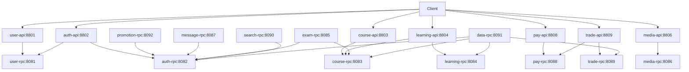

# 服务依赖拓扑与调用链 Specification

## Purpose

定义 tjxt 13 个微服务之间的依赖关系、三条核心跨服务 RPC 调用链、服务间契约原则，以及跨服务数据访问与数据域边界规则。本规格是判断「某服务是否有权调用另一服务」与「跨域数据应如何取得」的权威依据：任何跨服务取数必须走目标服务的 RPC 或事件，严禁直连他库、直连 `internal` 包。同时给出生产部署拓扑视图（K8s），作为本地 `docker-compose` 环境的上位形态。

## Requirements

### Requirement: 服务依赖拓扑

服务间依赖 SHALL 以「API 层 → RPC 层 → DB/MQ」单向流动，下图为 wiki 记载的**设计意图拓扑**（端口已按实测更正）；由于部分依赖尚未接线，实际可用链路以紧随其后的「接线状态表」为准。



> 源冲突说明 1：wiki `00-architecture/service-topology.md` 的 mermaid 图中 `auth-api` 标注为 8801、`auth-rpc` 标注为 8081。实测 26 份 `etc/*.yaml`，实际为 `user-api 8801` / `auth-api 8802`、`user-rpc 8081` / `auth-rpc 8082`，上图已按实测更正。
>
> 源冲突说明 2：上图源自设计意图，**多数 API→auth-rpc 的边并未实际接线**——各服务普遍通过自身 yaml 的 `Auth.AccessSecret` + go-zero JWT 中间件本地校验，而非调用 auth-rpc。仅表中 ✅ 项可视为真实链路。

**实际接线状态**（以 `ServiceContext` 中 client 是否实例化、logic 是否调用为准）：

| 调用方 | 被调方 | 状态 | 说明 |
|--------|--------|------|------|
| auth-api | user.rpc | ✅ 已接线 | 登录时调 `LoginVerify` 核验凭证 |
| trade-rpc | pay.rpc | ✅ 已接线 | 支付/退款经 pay 代理 |
| search-rpc | course.rpc | ✅ 已接线 | 课程索引数据源 |
| learning-api | course.rpc | ✅ 已接线 | 校验课程有效性 |
| course-rpc | user.rpc | ❌ 未接线 | 教师姓名/头像留空 |
| course-rpc | learning.rpc | ❌ 未接线 | `lesson_id` 填 0 |
| course-rpc | media.rpc / exam.rpc | ❌ 未接线 | 媒资/题目存在性校验缺失 |
| trade-rpc | promotion.rpc | ❌ 未接线 | 优惠未接入，实付金额未扣减 |
| exam-rpc | course.rpc | ❌ 未接线 | 图中为设计意图 |
| data-rpc | course / trade / learning | ❌ 未接线 | data 当前无上游 RPC 客户端配置，数据为回填/快照 |
| 各服务 | auth.rpc（token 校验） | ⚠️ 多数未接线 | 改用本地 JWT 中间件校验 |
| pay-rpc | 真实支付网关 | ⚠️ 占位 | demo 回调 URL，非真实渠道 |
| trade-rpc | RabbitMQ | ⚠️ 未发射 | Producer 已装配但 logic 未调 `Publish` |
| course-rpc | RabbitMQ | ✅ 已接线 | 上下架事件 → search 增量同步 |

#### Scenario: 判断一次跨服务调用是否合规

- **WHEN** 服务 A 需要服务 B 的数据
- **THEN** 先在本规格的依赖表中确认该调用已被声明；未声明的须先在调用方 `go.mod` 增加 `require` + 本地 `replace`，并在 `ServiceContext` 装配 client
- **AND** 一律通过 B 的 RPC client 调用，直连 `tj_<b>` 库或 import B 的 `internal` 包均为违规

#### Scenario: 未接线依赖的降级表现

- **WHEN** 调用方依赖尚未接线（如 course 取教师姓名）
- **THEN** 当前实现返回零值/空值（填 0、字段留空）而非报错
- **AND** 该降级行为须在对应服务 spec 中以「已知缺口」标注，避免被调用方误当作数据源

### Requirement: 核心 RPC 调用链

关键业务链路 SHALL 按下列路径编排（标注 ⚠️ 者为当前代码尚未打通的环节）：

**下单支付链路**

```
Client → trade-api → trade-rpc   (创建订单)
                  ⚠️ promotion-rpc (校验优惠券，未接线)
                   → pay-rpc      (发起支付)
                   → pay-rpc      (回调确认)
                  ⚠️ message-rpc  (发送下单通知)
                  ⚠️ learning-rpc (解锁课程，实际改由 MQ 事件驱动且事件未发射)
```

**学习进度同步链路**

```
Client → learning-api → learning-rpc (记录进度)
                     → course-rpc    (校验课程有效性，已接线)
                    ⚠️ message-rpc  (进度提醒/证书发放)
```

**文件上传签名链路**

```
Client → media-api → media-rpc (获取上传签名)
                  ⚠️ auth-rpc (校验身份)
```

#### Scenario: 下单支付

- **WHEN** 客户端提交下单请求
- **THEN** trade-api 调 trade-rpc 创建订单，再经 pay-rpc 发起支付并在回调中确认
- **AND** 优惠券试算（promotion-rpc）与课程解锁（learning 侧）当前未打通：前者因 trade 未接线 promotion，后者因订单事件未发射

#### Scenario: 学习进度记录

- **WHEN** 客户端上报学习进度
- **THEN** learning-api 调 learning-rpc 记录，并经 course-rpc 校验课程有效性
- **AND** 进度提醒/证书发放依赖 message-rpc，当前未接线

### Requirement: 服务间契约原则

跨服务调用 SHALL 遵守以下五条原则：

1. **接口稳定**：RPC 方法签名变更需向下兼容，新增字段用 `optional`
2. **超时控制**：跨服务调用统一 3s 超时，可在 `servicecontext` 配置覆盖
3. **熔断降级**：go-zero 内置熔断器，关键链路需配置 fallback
4. **幂等性**：写操作 RPC 需携带 `Idempotency-Key` 或业务主键保证幂等
5. **链路透传**：`trace-id` 通过 metadata 自动透传，日志与链路据此关联

#### Scenario: 下游超时

- **WHEN** 服务 A 调用服务 B 超过 3s
- **THEN** 调用方按超时返回错误，不无限等待
- **AND** 特定链路可在 `servicecontext` 中覆盖该默认值，但须在对应服务 spec 的配置表中记录

#### Scenario: 重复请求

- **WHEN** 同一写操作因重试被调用两次
- **THEN** 依赖 `Idempotency-Key` 或业务主键保证结果一致
- **AND** 缺少幂等键的写接口须在服务 spec 中标注风险

### Requirement: 跨服务数据访问规则

跨域数据 SHALL 只经目标服务 RPC 获取，禁止直连他库：

| 场景 | 正确做法 | 禁止做法 |
|------|----------|----------|
| trade 需要课程价格 | 调用 course-rpc `GetCourse` | 直接查 `tj_course.course` |
| learning 需要用户信息 | 调用 user-rpc `GetUserById` | 直接查 `tj_user.user` |
| data 大屏需要交易汇总 | 调用 trade-rpc `GetTradeStats` | 直接查 `tj_trade.order` |
| promotion 校验用户身份 | 调用 auth-rpc `VerifyToken` | 共享 JWT secret 自己解析 |

#### Scenario: 大屏聚合取数

- **WHEN** data 服务需要交易/课程/学习三方汇总数据
- **THEN** 分别调用对应服务的 RPC 聚合，不直连 `tj_trade` / `tj_course` / `tj_learning`
- **AND** data 自身不持有关系型库（无 `DataSource`），所有数据来自上游 RPC 或快照

#### Scenario: 需要校验 JWT 的服务

- **WHEN** 某服务需要确认请求者身份
- **THEN** 调用 auth-rpc 的校验接口
- **AND** 禁止通过共享 `AccessSecret` 自行解析 token（密钥扩散会导致轮换失效）

### Requirement: 数据域边界与 SQL 版本管理

一库一服务 SHALL 作为数据域边界，SQL 脚本 SHALL 分目录管理并在发布前同步。

- 库名规则：`tj_<domain>`，每服务独享；data 服务无独立库
- 纯 DDL：`sql/ddl/tj_<domain>.sql`（goctl model 专用，仅建表/索引）
- 含数据迁移：`sql/migration/tj_<domain>.sql`（上线执行，含初始数据与结构变更）
- 版本控制：每次发布前必须同步更新对应 DDL 文件，CI 校验 model 生成无报错

#### Scenario: 表结构变更

- **WHEN** 某域新增表或字段
- **THEN** `sql/ddl/` 与 `sql/migration/` 两个目录下的同名脚本同时更新
- **AND** 只更新一处会导致 goctl model 与实际库结构漂移

### Requirement: 生产部署拓扑

生产环境 SHALL 以 K8s 承载，配置与密钥分离，可观测性沿用 collector 统一入口：

- 工作负载：K8s `Deployment` + `Service` + `HPA`（按 CPU/内存或自定义指标扩缩）
- 配置管理：`ConfigMap` 管理 `etc/*.yaml`，`Secret` 管理数据库口令、JWT `AccessSecret`、对象存储密钥等敏感项
- 可观测性：OpenTelemetry Collector 作为 trace/metrics/logs 统一入口；Jaeger（链路）/ Prometheus + Grafana（指标）/ Loki + Grafana（日志）
- 本地形态：上述生产拓扑在本地退化为 `docker-compose` 的 8 容器（MySQL / Redis / RabbitMQ / etcd / Jaeger / otel-collector / Prometheus / Loki），Go 服务在宿主机直跑

> 已知缺口：仓库当前仅有 `docker-compose.yml` 与 `deploy/` 下的 collector / prometheus / loki 配置，**尚无 K8s 编排清单**；`Auth.AccessSecret` 等敏感值仍以明文写在 `etc/*.yaml`（开发默认 `change-me-in-production`），上生产前须改为 Secret 注入。

#### Scenario: 从本地切换到生产

- **WHEN** 将服务部署到 K8s
- **THEN** 配置由 ConfigMap 挂载、敏感项由 Secret 注入，服务镜像内不含明文密钥
- **AND** 各服务保留 `Telemetry` / `Prometheus` / `Log` 三段配置，信号继续汇入集群内的 collector

#### Scenario: 敏感配置外泄风险

- **WHEN** 审视现有 `etc/*.yaml`
- **THEN** 其中的 `Auth.AccessSecret`、`DataSource` 口令、MQ 凭据须判定为待迁移到 Secret 的项
- **AND** 在迁移完成前，这些 yaml 不得进入公开仓库分发
